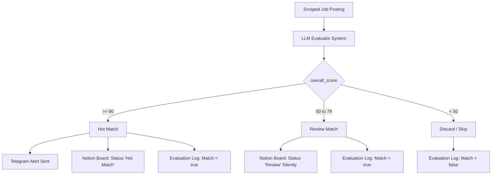

# SOP: Scoring Thresholds & Routing Tuning Guide

This document outlines the operational guidelines for running, monitoring, and tuning the **Multidimensional Scoring and Routing System** in the AI Recruiter project.

---

## 1. System Architecture Overview

The matching pipeline has transitioned from a fragile, binary (`yes/no`) classification to a robust, multidimensional score-based routing tree.

Instead of rejecting borderline vacancies immediately, every job posting receives a score from `0` to `100` on multiple dimensions:
*   **`overall_score`**: Composite weighted match percentage (0 to 100).
*   **`tech_stack_match`**: Fit score of core libraries, languages, and architecture (0 to 100).
*   **`seniority_match`**: Fit score of target seniority requirements (0 to 100).
*   **`red_flags`**: Explicit reasons for point deductions.

### The 3-Tier Routing Logic
Jobs are classified and routed into one of three buckets based on `overall_score`:



---

## 2. Notion Schema & Property Mapping

The new scoring dimensions are fully logged in both **AI Recruiter Board** and the **Evaluation Log** databases.

### Property Map

| Notion Property | Type | n8n Mapping Key | Description |
|---|---|---|---|
| `Score` | Number | `overall_score` | Composite score (0-100) |
| `Tech Stack Match` | Number | `tech_stack_match` | Sub-score for stack matching |
| `Seniority Match` | Number | `seniority_match` | Sub-score for seniority fit |
| `Red Flags` | Multi-select | `red_flags` | List of explicit deduction reasons |

---

## 3. How to Tune Routing Thresholds

If you find that the pipeline is either **too strict** (missing good contracts) or **too spammy** (sending too many low-quality Telegram alerts), you can easily adjust the threshold values in the n8n UI.

### Step-by-Step Tuning:

1. **Open n8n Editor**: Navigate to your local or hosted n8n instance and open the `Ingest Jobs` workflow.
2. **Find Routing Nodes**: Scroll to the right, immediately following the `Notion: Log to Eval Log` node. You will find two serial conditional nodes:
   *   **`IF: Score >= 80?`**: Governs what goes to Telegram + Notion Hot Match.
   *   **`IF: Score >= 50?`**: Governs what is saved for Review vs what is discarded.
3. **Edit Threshold Value**:
   *   Double-click the node you want to adjust.
   *   In the **Conditions** block, find the rule `score-ge-80` or `score-ge-50`.
   *   Modify the `Value 2` field (e.g. change `80` to `75` to make Telegram alerts less strict; or change `50` to `60` to discard more borderline roles).
4. **Save Workflow**: Click **Save** in the n8n UI to apply the changes to production instantly.

---

## 4. Promptfoo Regression Tests Updates

When permanently updating production thresholds, you **MUST** update the test suites in the baseline code to prevent CI/CD failures.

### Updating assertions:
Open [gold_dataset.yaml](file:///Users/Darya_Shashko/projects/recruiter/n8n/prompts/gold_dataset.yaml) and update the threshold assertions.

*   If you changed **Hot Match** to `>= 75`, update all true matches (`T01-T08`) assertions to:
    ```yaml
      assert:
        - type: javascript
          value: "JSON.parse(output).overall_score >= 75"
    ```
*   If you changed **Review Match** floor to `>= 60`, update all false matches (`F01-F07`) assertions to check `< 60`:
    ```yaml
      assert:
        - type: javascript
          value: "JSON.parse(output).overall_score < 60"
    ```

After making adjustments, run local validation to ensure your prompt still achieves 100% accuracy:
```bash
cd scraper && npm run eval
```

---

## 5. Troubleshooting & Prompt Optimization

### Issue: LLM gives 60+ scores to roles in Warsaw/Kraków (disqualified location)
*   **Why**: The model weighs Seniority/Stack so high that it averages them out above 50, bypassing the city constraint.
*   **Mitigation**: The prompt contains a **`CRITICAL RULE`** stating that any disqualifying criteria must hard-stop the overall score `< 50`. If this drifts, ensure your LLM model is not suffering from temperature settings (keep `temperature: 0` in `promptfooconfig.yaml`).

### Issue: Borderline Node/Java contract scores 45 (discarded) but is highly lucrative
*   **Mitigation**: Lower the `IF: Score >= 50?` node threshold to `40`. This places it safely in the **Review** column of your Notion Kanban board, giving you a chance to inspect it manually without spamming your Telegram alerts.
